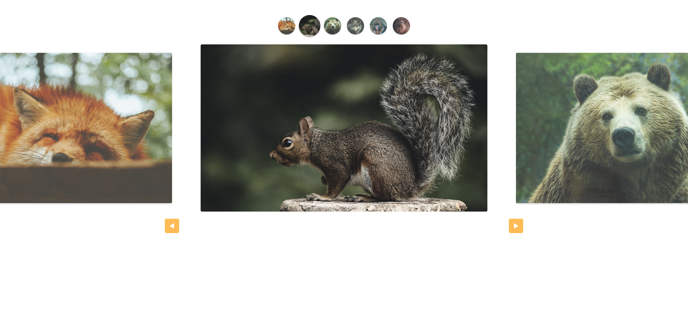

  

# 🚲 Slide JS
Projeto de um site de vendas de bicicletas personalizadas. Nesse projeto eu aprendi bastante sobre sobre HTML e CSS, depois desse projeto e outras práticas aprimorei muito meu CSS.

## ⚙️ Funcionalidades

- [x] Site totalmente responsivo e com várias páginas;
- [x] Site com animações para aprimorar a experiência do usuário;
- [x] Site com formulário dinámico feito sem JavaScript, ao clicar no item ele já é selecionado;
- [x] Projeto segue os conceitos de Ui/Ux Design;
- [x] Do Figma ao código, desde a ideia inicial até o projeto final;

## 🚀 Tecnologias

- [HTML](https://www.w3schools.com/html/)
- [CSS](https://developer.mozilla.org/pt-BR/docs/Web/CSS)
- [JavaScript](https://developer.mozilla.org/pt-BR/docs/Web/JavaScript)

## 📝 Considerações

Nesse projeto do curso da Origamid, eu pude aprender bastante sobre Ui/Ux design, desde a prototipação até o código, e com os conhecimentos desse projeto e muita prática dominei bastante o HTML e CSS;
